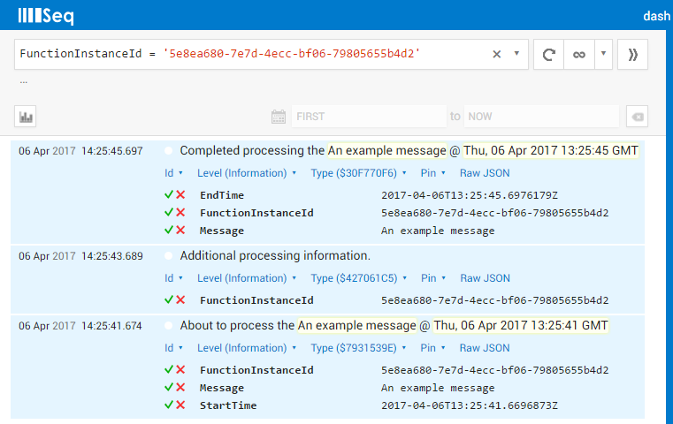

# Serilog.Extensions.WebJobs

[](https://www.nuget.org/packages/Serilog.Extensions.WebJobs "NuGet Version")
[](https://ci.appveyor.com/project/JSkimming/serilog-extensions-webjobs "Build status")
[](https://codecov.io/gh/JSkimming/serilog-extensions-webjobs "Code coverage")
[](https://github.com/JSkimming/serilog-extensions-webjobs/releases "Latest release")
<!--[](https://scan.coverity.com/projects/4829 "Coverity Scan Status")-->

An extension to enable logging through Serilog for Microsoft Azure WebJobs.

This package routes Azure WebJob log messages through Serilog, so you can get information about WebJobs internal operations and function logs to the same Serilog sinks as the rest of your application events.

### Instructions

**First**, install the _Serilog.Extensions.WebJobs_ [NuGet package](https://www.nuget.org/packages/Serilog.Extensions.WebJobs) into your Azure WebJobs console app.

_**NOTE:** The Azure WebJobs SDK already outputs log messages to the console, therefore unless you require extra features of Serilog (additional sinks, extra enrichers, etc.), no additional packages are required._

```powershell
Install-Package Serilog.Extensions.WebJobs
```


**Next**, in your application's `Main` method, configure Serilog first:

```csharp
using Microsoft.Azure.WebJobs;
using Serilog;

class Program
{
  static void Main()
  {
    Log.Logger = new LoggerConfiguration()
      .Enrich.FromLogContext()
      .CreateLogger();
      
    // Other startup code
```

**Finally**, configure the Azure WebJob host to use Serilog by adding a call to `UseSerilog()`:

```csharp
    var config = new JobHostConfiguration();
    config.UseSerilog();

    var host = new JobHost(config); // <-- Don't forget it inject to config into the job host.

    // The following code ensures that the WebJob will be running continuously
    host.RunAndBlock();
  }
}
```

That's all the initialization complete. If you now set-up additional sinks, both the internal WebJob logs, and the logs from any of your functions will gp through Serilog.

### Inject `ILogger` into WebJob functions

Now that Serilog has been configured, it's now possible to use Serilog directly within the WebJob functions.

Instead of writing WebJob functions that take a `TextWriter` log like this:

```csharp
using System.IO;
using Microsoft.Azure.WebJobs;

public class Functions
{
  // This function will get triggered/executed when a new message is written
  // on an Azure Queue called queue.
  public static void ProcessQueueMessage([QueueTrigger("queue")] string message, TextWriter log)
  {
    log.WriteLine(message);
  }
}
```

You can now specify an `ILogger` log as a parameter instead:

```csharp
using Microsoft.Azure.WebJobs;
using Serilog;

public class Functions
{
  // This function will get triggered/executed when a new message is written
  // on an Azure Queue called queue.
  public static void ProcessQueueMessage([QueueTrigger("queue")] string message, ILogger log)
  {
    log.Information(message);
  }
}
```

Any logs written to the Serilog `ILogger` will be written to both Serilog, and to the underlying stream that would otherwise have been written to using the `TextWriter`. This ensures that logs still show up in the Microsoft Azure WebJobs dashboard.

_**NOTE:** You must inject the `ILogger` rather than using the global `Log.Logger` otherwise the log messages will not be written to the Microsoft Azure WebJobs dashboard. You will also loose the added benefits of [Automatic log message property enrichment](#automatic-log-message-property-enrichment)._

### Automatic log message property enrichment

An additional benefit of using an injected `ILogger` into a WebJob function is that the log context is enriched with the _FunctionInstanceId_ property. The _FunctionInstanceId_ property is a unique identifier for every function invocation.

This proves to be very useful when logging to a structured log server, such as [Seq](https://getseq.net/).

To demonstrate this feature the example function above had been updated to:

 ```csharp
using Microsoft.Azure.WebJobs;
using Serilog;

public class Functions
{
  // This function will get triggered/executed when a new message is written
  // on an Azure Queue called queue.
  public static void ProcessQueueMessage([QueueTrigger("queue")] string message, ILogger log)
  {
    log.Information("About to process the {Message} @ {StartTime:R}", message, DateTime.UtcNow);
    await Task.Delay(2000);
    log.Information("Additional processing information.");
    await Task.Delay(2000);
    log.Information("Completed processing the {Message} @ {EndTime:R}", message, DateTime.UtcNow);
  }
}
```

When the function now executes with Seq logging, it provides the possibility to filter by _FunctionInstanceId_.

